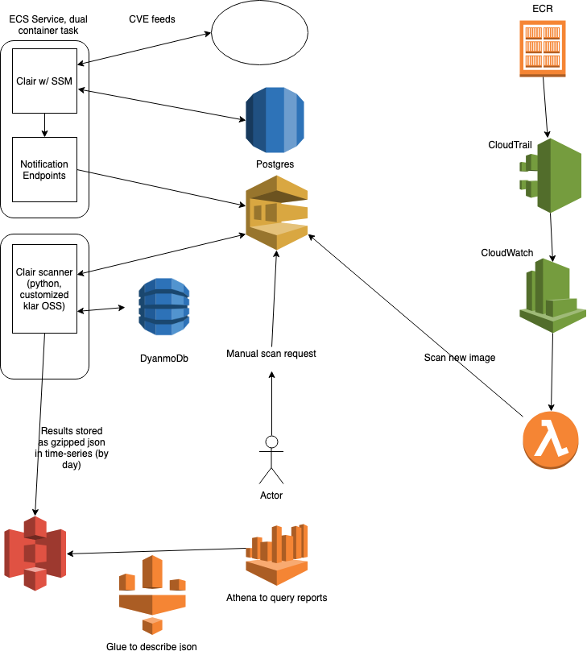

# Overview

[ecr-cve-monitor](https://github.com/sriddell/ecr-cve-monitor) is an open-source proof-of-concept based on [Clair](https://github.com/coreos/clair) and [Klar](https://github.com/sriddell/klar), modified specifically for use with ECR repositories.  Any images pushed to a repository in an ECR registry will be automatically scanned and have a report generated for them.  Any new CVEs that come in that affect an already scanned image will trigger the creation of an updated report.

Reports are stored as gzip compressed JSON files in time-series in S3, making it easy to query for images with CVEs via AWS Athena.

## High level diagram

## Basic features

ecr-cve-monitor is message-based.  All operations are passed as messages on an SQS queue to provide automatic retries, with a final dead-letter queue.

Clair itself functions by 'indexing' all layers in a docker image for 'features', and then stores those features in postgres.  If a new CVE comes in to Clair that affects a layer Clair has already indexed, it issues a notification to the (custom ecr-cve-monitor) notification endpoint, which converts it to a rescan message on the input queue.

If a new image is pushed to ECR, CloudTrail generates a CloudWatch event, which triggers a small lambda function that puts a scan image message on the input queue for the new image.

Thus, new images are automatically added to those monitored, and existing images that are affected by new CVEs can be identified.

To bootstrap a new installation some simple python scripts are provided to generate and load 'ScanImage' messages to the pending scan queue for all existing images in a given ECR registry (bootstrap-create-messages.py and bootstrap-load-messages.py).  The clair and scanner instances can be temporarily scaled up during the initial load to reduce the time it takes to index an existing large registry.

Although it has only been tested with a single registry so far, it was designed to handle multiple registries and regions, assuming you set up the necessary cross-account permissions to allow the account ecr-cve-monitor is deployed to to be able to pull all images is the other accounts ECR registry.

## Reporting

Any time an image is scanned, either because it was just pushed to a repo, or because Clair detected that a layer in the image is affected by a new CVE, ecr-cve-monitor generates a new JSON report of all vulnerabilities in that image and stores the result in s3 under a year/month/day time-series scheme.  (So for a given day, only 1 report at most will exist for an image).

Athena can then be used to generate reports such as 'show me any image with more than 1 high level CVE'.  Or 'show me any new high CVE vulnerabilities in the last 2 days'.  The time-series storage also allows only a small amount of the data to be loaded into an athena partition, so you can scan a small subset of the data for any new vulnerabilities in the last 24 hours, for example.

### Implementation details

Clair does not recognize or track images directly - it only scans and knows about layers.  Software that uses Clair (in ecr-cve-monitor, the clair scanner) is reponsible for sending in each layer with a unique id.  The clair scanner is then responsible for tracking which layers are present in which docker images in the ECR registry.  ecr-cve-monitor accomplishes this by mapping the unique layer ID to the image as identified by its unique registry ID in a dynamo DB table.

Note that uniquely identifying images is a bit confusing.  Images have an internal sha256 identifier, but this is not the address of the image in ECR (or any registry).  Registries appear to assign images a unique sha256 ID (at least ECR does), separate from the image sha256.  This is the true unique ID within an ECR registry.  Docker tags are mutable, and thus cannot be tracked because they could change over time.

So the reports are generated in terms of the ECR registry identifier, repo id, and registry sha256 ID (which permanently identifies an image in an ECR registry).

A second layer of reporting would be necessary to translate Athena query results into images using the human-friendly tags assigned to that image, although it would only be guaranteed accurate at the time of the report, as the tags (particularly the 'latest' tag) can change.

### Catching vulnerabilities during build

Failing a build requires a different technique, as we'd want to catch the vulnerability before the image is pushed to ECR.  This can be done by a simpler project.  The [clair-local-scan](https://github.com/arminc/clair-local-scan) project generates up-to-date databases full loaded with CVE vulnerabilities that can be used to pre-scan images before pushing them to ECR.  This is dockerized, so you can quickly start a pre-loaded instance of clair, scan a single (local) image for a vulnerability report, and fail a build before the image is pushed.

### Acting on ecr-cve-monitor reports

ecr-cve-monitor, of course, just tells you about OS level CVE vulnerabilities in your containers.  To fully put it into effect, you need to decide for your organization how to deal with images identified as vulnerable.  This could involve quarantining them so they can't be further deployed, blocking deployment of them via your DevOps pipeline, or further reporting on however you run your containers (ECS, EKS, etc) to identify vulnerable images that are actively running.  The optimal mix of techniques of course depends on your SLAs, sensitivity to downtime, and the severity of a new CVE that is detected in an already running image.

## Disaster recovery

Any loss of information can be recovered by repopulating the reports from scratch (except historical time-series data).

## Why Clair

* From CoreOS team
* Opensource
* used to power vulnerability scanning in Quay.io
* Can generate reports without re-consuming layers
* Can raise new vulnerabilities against existing layers without actually rescanning the image

